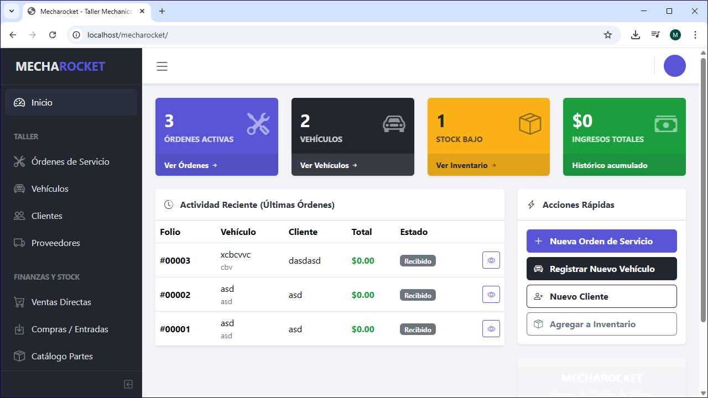

# Mecharocket 🚀

Mecharocket es un sistema integral de gestión para talleres mecánicos diseñado para optimizar el flujo de trabajo, desde la recepción del vehículo hasta la entrega final.

## ✨ Características Principales

- **Gestión de Órdenes de Servicio**: Control total sobre las recepciones, diagnósticos, asignación de mecánicos y estados de reparación.
- **Control de Inventario**: Catálogo de refacciones con alertas de stock bajo y gestión de categorías.
- **Ventas y Compras**: Registro de ventas directas de refacciones y entradas de mercancía por compras a proveedores.
- **Base de Datos de Clientes y Vehículos**: Historial detallado por cliente y vinculación de múltiples vehículos por dueño.
- **Catálogos del Sistema**: Configuración personalizada de áreas de trabajo, espacios físicos (bahías/elevadores) y servicios.
- **Branding del Taller**: Personalización de nombre, dirección, logotipos y datos de contacto para reportes.
- **Reportes en PDF**: Generación automática de comprobantes y órdenes de servicio listas para imprimir.

## 🛠️ Tecnologías Utilizadas

- **Backend**: PHP (Arquitectura MVC)
- **Base de Datos**: MySQL
- **Frontend**: CoreUI (Bootstrap 5), jQuery
- **Librerías**: DataTables, Select2, SweetAlert2, FPDF

## 🚀 Instalación Local

1.  **Requisitos**: Servidor local (XAMPP, WAMP, Laragon) con soporte para PHP 7.4+ y MySQL.
2.  **Base de Datos**: 
    - Crea una base de datos llamada `mecharocket`.
    - Importa el archivo `schema.sql` para crear las tablas necesarias.
3.  **Configuración**:
    - Edita el archivo `core/controller/Database.php` con tus credenciales de base de datos.
4.  **Acceso**:
    - Usuario por defecto: `admin`
    - Contraseña por defecto: `admin`

---
Desarrollado con ❤️ para la eficiencia automotriz.
